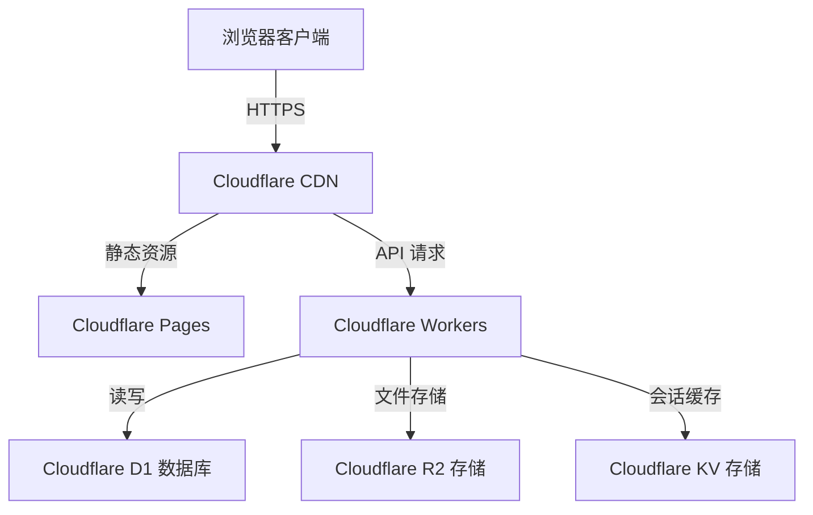

# 情侣约定记录系统 - 技术设计文档

Feature Name: couple-commitment-tracker
Updated: 2026-05-01

## 描述

基于 Cloudflare Pages + Workers + D1 + R2 + KV 构建的情侣约定记录 Web 应用，实现温馨浪漫风格的 UI，支持约定管理、打卡、照片上传、见面记录和进度统计功能。

## 架构



### 架构说明

1. **Cloudflare Pages**: 托管前端静态资源 (Vue 3 + Vite 构建)
2. **Cloudflare Workers**: 无服务器 API 后端，处理业务逻辑
3. **Cloudflare D1**: SQLite 数据库，存储约定、用户、见面记录等结构化数据
4. **Cloudflare R2**: 对象存储，存储用户上传的照片
5. **Cloudflare KV**: 键值存储，存储 JWT 会话和缓存数据

## 组件与接口

### 前端组件 (Vue 3)

| 组件 | 说明 |
|------|------|
| `LoginPage` | 登录页面，简单密码认证 |
| `Dashboard` | 仪表盘，显示统计数据和快捷入口 |
| `CommitmentList` | 约定列表，支持筛选和搜索 |
| `CommitmentForm` | 添加/编辑约定表单 |
| `CommitmentDetail` | 约定详情，包含照片和打卡历史 |
| `MeetingList` | 见面记录列表 |
| `MeetingForm` | 创建/编辑见面记录 |
| `PhotoUploader` | 照片上传组件 |
| `Statistics` | 进度统计图表 |

### API 接口设计

| 方法 | 路径 | 说明 | 认证 |
|------|------|------|------|
| POST | `/api/auth/login` | 用户登录 | 否 |
| POST | `/api/auth/logout` | 用户登出 | 是 |
| GET | `/api/commitments` | 获取约定列表 | 是 |
| POST | `/api/commitments` | 创建约定 | 是 |
| PUT | `/api/commitments/:id` | 更新约定 | 是 |
| DELETE | `/api/commitments/:id` | 删除约定 | 是 |
| POST | `/api/commitments/:id/checkin` | 打卡 | 是 |
| DELETE | `/api/commitments/:id/checkin` | 取消打卡 | 是 |
| POST | `/api/photos` | 上传照片 | 是 |
| DELETE | `/api/photos/:id` | 删除照片 | 是 |
| GET | `/api/meetings` | 获取见面记录列表 | 是 |
| POST | `/api/meetings` | 创建见面记录 | 是 |
| PUT | `/api/meetings/:id` | 更新见面记录 | 是 |
| DELETE | `/api/meetings/:id` | 删除见面记录 | 是 |
| GET | `/api/statistics` | 获取统计数据 | 是 |

## 数据模型

### D1 数据库表结构

#### users 表
```sql
CREATE TABLE users (
  id TEXT PRIMARY KEY,
  password_hash TEXT NOT NULL,
  created_at INTEGER NOT NULL,
  updated_at INTEGER NOT NULL
);
```

#### commitments 表
```sql
CREATE TABLE commitments (
  id TEXT PRIMARY KEY,
  title TEXT NOT NULL,
  description TEXT,
  category TEXT,
  status TEXT DEFAULT 'pending',
  completed_at INTEGER,
  created_at INTEGER NOT NULL,
  updated_at INTEGER NOT NULL,
  meeting_id TEXT REFERENCES meetings(id)
);
```

#### checkins 表
```sql
CREATE TABLE checkins (
  id TEXT PRIMARY KEY,
  commitment_id TEXT NOT NULL REFERENCES commitments(id),
  checked_at INTEGER NOT NULL,
  created_at INTEGER NOT NULL
);
```

#### meetings 表
```sql
CREATE TABLE meetings (
  id TEXT PRIMARY KEY,
  date TEXT NOT NULL,
  location TEXT,
  notes TEXT,
  created_at INTEGER NOT NULL,
  updated_at INTEGER NOT NULL
);
```

#### photos 表
```sql
CREATE TABLE photos (
  id TEXT PRIMARY KEY,
  commitment_id TEXT REFERENCES commitments(id),
  meeting_id TEXT REFERENCES meetings(id),
  r2_key TEXT NOT NULL,
  filename TEXT NOT NULL,
  content_type TEXT NOT NULL,
  size INTEGER NOT NULL,
  created_at INTEGER NOT NULL
);
```

#### settings 表
```sql
CREATE TABLE settings (
  key TEXT PRIMARY KEY,
  value TEXT NOT NULL,
  updated_at INTEGER NOT NULL
);
```

### R2 存储结构

```
/photos/
  └── {commitment_id}/
      └── {photo_id}_{timestamp}.jpg
```

### KV 存储结构

```
Key 格式：
- session:{session_id} -> JWT token 数据
- cache:statistics:{user_id} -> 统计数据缓存
```

## 正确性属性

### 不变量

1. 每个约定必须有一个有效的状态（pending/completed）
2. 照片上传大小不能超过 5MB
3. 所有写入操作必须通过认证
4. 打卡时间与当前时间误差不能超过 1 小时（防作弊）

### 约束条件

1. D1 数据库写入有速率限制（免费版 5 次/秒）
2. R2 存储有带宽限制（免费版 10GB 存储，10GB/月读取）
3. Workers 有执行时间限制（免费版 10ms CPU 时间）

## 错误处理

### 错误场景与处理策略

| 场景 | 错误码 | 处理策略 |
|------|--------|----------|
| 认证失败 | 401 Unauthorized | 返回登录页面，清除本地会话 |
| 权限不足 | 403 Forbidden | 显示错误提示，记录日志 |
| 资源不存在 | 404 Not Found | 显示友好的 404 页面 |
| 数据验证失败 | 400 Bad Request | 显示具体验证错误信息 |
| 文件过大 | 413 Payload Too Large | 提示文件限制 |
| 服务器错误 | 500 Internal Server Error | 显示错误页面，记录详细日志 |

### 前端错误处理

```typescript
// 统一错误处理中间件
try {
  await apiRequest()
} catch (error) {
  if (error.status === 401) {
    redirectToLogin()
  } else if (error.status === 413) {
    showToast('文件大小超过限制')
  } else {
    showToast('操作失败，请重试')
  }
}
```

## 测试策略

### 单元测试

- 前端组件单元测试 (Vitest)
- API 处理器逻辑测试
- 数据验证函数测试

### 集成测试

- 完整的用户登录流程
- 约定 CRUD 完整流程
- 照片上传下载流程

### E2E 测试

- 使用 Playwright 进行端到端测试
- 模拟真实用户操作场景

## 技术栈

| 层次 | 技术 | 版本 |
|------|------|------|
| 前端框架 | Vue 3 + TypeScript | 3.4+ |
| 构建工具 | Vite | 5.x |
| UI 组件库 | Naive UI / Element Plus | 最新 |
| 状态管理 | Pinia | 2.x |
| 路由 | Vue Router | 4.x |
| HTTP 客户端 | Axios | 1.x |
| 图表 | ECharts / Chart.js | 最新 |
| 后端 | Cloudflare Workers | latest |
| 数据库 | Cloudflare D1 | latest |
| 对象存储 | Cloudflare R2 | latest |
| 缓存 | Cloudflare KV | latest |
| 认证 | JWT | latest |

## Cloudflare 资源配置

### 需要的资源

1. **Pages**: 1 个项目（免费）
2. **Workers**: 1 个 Worker 脚本（免费额度：10 万次请求/天）
3. **D1**: 1 个数据库（免费额度：500 万次读取/月）
4. **R2**: 1 个存储桶（免费额度：10GB 存储 + 10GB 读取/月）
5. **KV**: 1 个命名空间（免费额度：10 万次读取/天）

### 初始化命令

```bash
# 创建 D1 数据库
wrangler d1 create couple-commitment-db

# 创建 KV 命名空间
wrangler kv:namespace create couple-session

# 创建 R2 存储桶
wrangler r2 bucket create couple-photos

# 部署 Workers
wrangler deploy

# 部署 Pages
wrangler pages deploy dist/
```

## 实现计划

### 阶段 1: 项目初始化 (1 天)
- [ ] 创建 Vite + Vue 3 项目
- [ ] 配置 Cloudflare Workers 环境
- [ ] 数据库表结构设计与初始化

### 阶段 2: 核心功能 (2 天)
- [ ] 用户认证模块
- [ ] 约定管理 CRUD
- [ ] 打卡功能

### 阶段 3: 照片与见面 (2 天)
- [ ] R2 照片上传下载
- [ ] 见面记录管理
- [ ] 照片与约定的关联

### 阶段 4: 统计与优化 (1 天)
- [ ] 统计数据 API
- [ ] 前端统计图表
- [ ] UI 美化与响应式适配

### 阶段 5: 测试与部署 (1 天)
- [ ] 单元测试编写
- [ ] E2E 测试
- [ ] 生产环境部署

## 安全考虑

1. **密码加密**: 使用 bcrypt 加密存储密码
2. **JWT 认证**: 使用短期 token（24 小时过期）
3. **CORS**: 限制允许的域名访问
4. **输入验证**: 所有输入进行严格验证和转义
5. **文件类型检查**: 上传文件验证 MIME 类型
6. **速率限制**: 对敏感操作进行速率限制

## 性能优化

1. **前端懒加载**: 路由和组件按需加载
2. **图片压缩**: 上传前压缩照片
3. **KV 缓存**: 统计数据缓存 5 分钟
4. **分页查询**: 大数据列表分页展示
5. **CDN 加速**: 静态资源通过 CDN 分发

## 参考资料

[^1]: (Cloudflare Docs) - [Workers 官方文档](https://developers.cloudflare.com/workers/)
[^2]: (Cloudflare Docs) - [D1 数据库指南](https://developers.cloudflare.com/d1/)
[^3]: (Cloudflare Docs) - [R2 对象存储](https://developers.cloudflare.com/r2/)
[^4]: (Vue.js Docs) - [Vue 3 官方文档](https://vuejs.org/)
[^5]: (Vite Docs) - [Vite 构建工具](https://vitejs.dev/)
